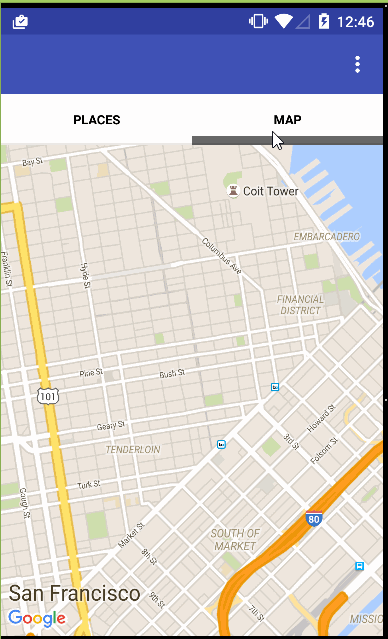
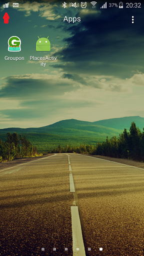
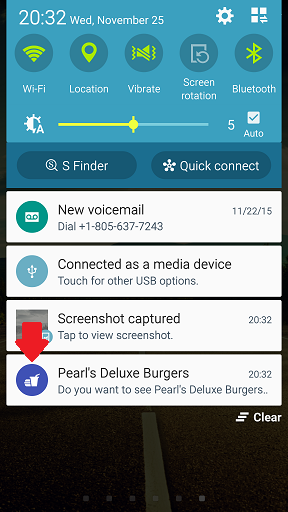
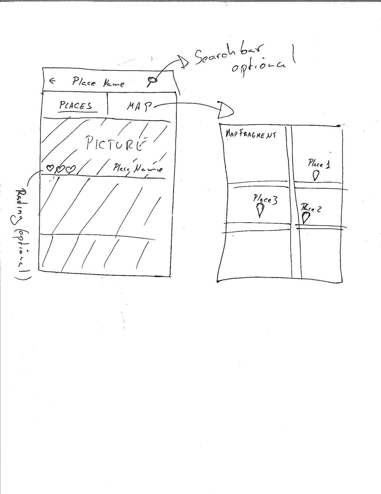
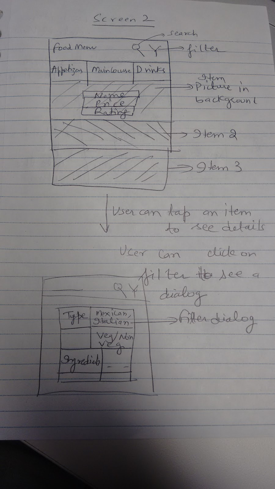
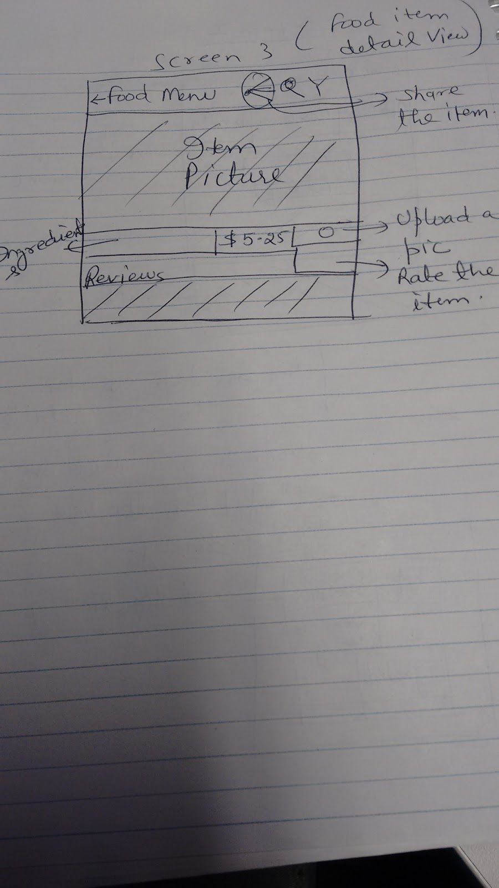

# Foodaholic
## Video Walkthrough 

Here's a walkthrough of implemented user stories:

Some captures of the beacon discovery services pushing notifications:

## Description
Foodaholic allows you to discover great local restaurants by seeing pictures and reviews of each item in their menu. Whether you are looking for a place to eat or just want to decide what you are going to order Foodaholic is your app.

## User Stories
1. App will push a notification when the app reach a eddystone beacon.
	- If the user select the notification, the app will display the menu for the restaurant associated with the beacon. We will do this using a Service and Google proximity API.
	- (Optional) the notification will be automatically dismiss once the app leave the beacon region.
	- The user must have the option to disable notifications. (Optional) The notifications can be disabled by time intervals.
2. When the app is executed it will display the closest restaurants in two separated tabs one for the list of restaurants with a picture and name and in the other tab a Map with all the locations.
        - The app will allow to access previously stored data when internet is not available.
3. Once the restaurant has been chosen either by 1 or 2. The app will display the food in the menu.
  - For each type of dish there will be a tab (i.e: appetizers, dessert, beverages..) and this tab will contain the list of items in different fragments.
  - All the items in the menu will have pictures and the pictures will be as big as possible. If it is possible the user will be able to navigate between pictures of the same item by dragging horizontally. This will allow the user to navigate through the hole menu without leaving the activity.

4. If one of the items is chosen, the app will show a detail view containing: Name of the item, pictures, reviews,...

### Optional
1. Search restaurants in map screen.
2. Filtering dishes in menu screen.
3. Social features (rating, sharing, upload picture).
4. Add pictures. 
5. Accept orders and simulated payments.

# Wireframe

## Search restaurant
This activity will allow to navigate between the different places avalables.

## Menu
This activity will allow to navigate through a restaurant menu.

## Detail
This activity will show the details of one item of the menu.

# Inspiration

